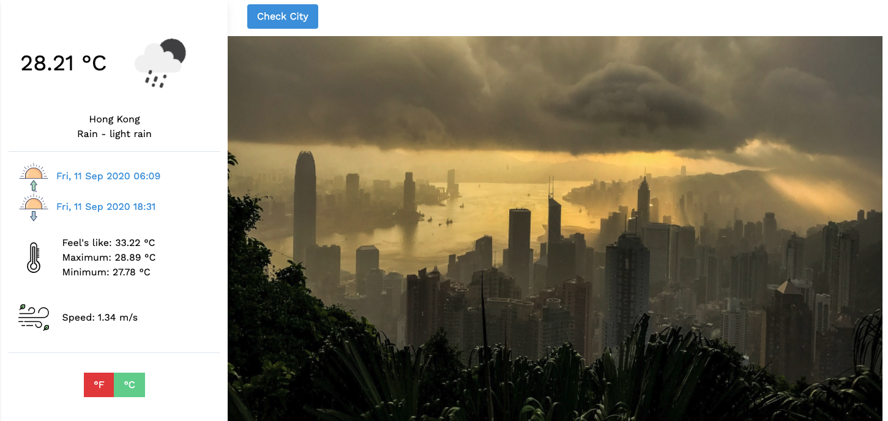

# Weather - A Microverse educational project

Building a weather app to learn about asynchronous functions in JavaScript and connecting to third party APIs

)

## Built With

-   HTML5
-   CSS3
-   Javascript
-   Webpack

## Live Demo

[Live Demo](https://rawcdn.githack.com/santiagorodriguezbermudez/weather/69a05cba69bbadab634d603c05b450f54afcc7c1/dist/index.html)

## Getting Started

- Fork the repository and create a local one on your computer;
- Move to the repository inside the command line using `cd` and the path to the file;
- Deploy index.html on your local server. 

## Authors

👤 Santiago Rodriguez
- Github: [@santiagorodriguezbermudez](https://github.com/santiagorodriguezbermudez)
- Twitter: [@srba87](https://twitter.com/srba87)
- Linkedin: [srba87](https://linkedin.com/in/srba)

## 🤝 Contributing

Contributions, issues, and feature requests are welcome!

## 📝 License

Illustrations by Katerina Limpitsouni from [unDraw](https://undraw.co/) 
Icons made by <a href="https://www.flaticon.com/authors/good-ware" title="Good Ware">Good Ware</a> from <a href="https://www.flaticon.com/" title="Flaticon"> www.flaticon.com</a> 
This project is [MIT](LICENSE) licensed.